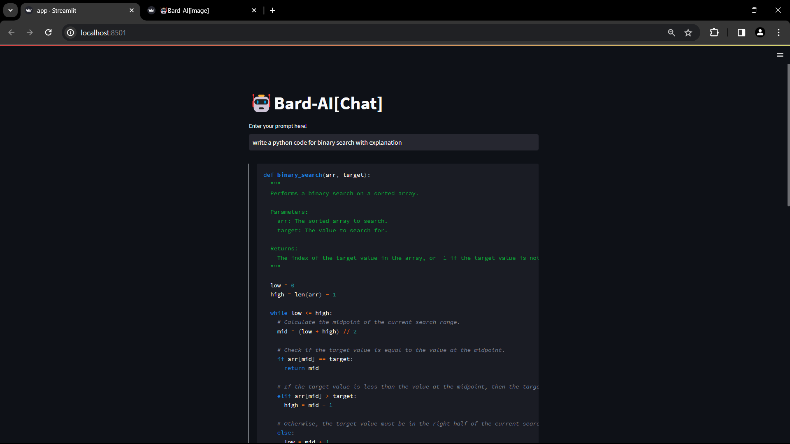
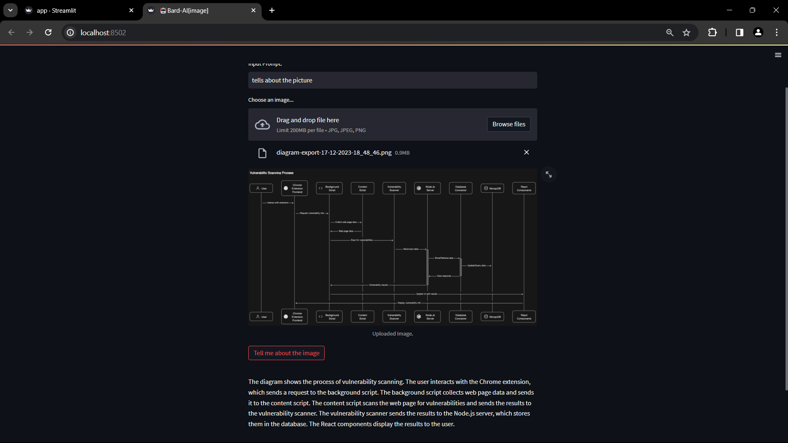

# Google Gemini LLM Model 


## Bard-AI Chat

This Streamlit app interacts with Google's GenerativeAI to generate text based on user prompts using the GPT model 'gemini-pro'.

### Usage

1. **Installation**

   - Clone the repository:

     ```bash
     git clone https://github.com/your_username/bard-ai.git
     cd bard-ai
     ```

   - Install dependencies:

     ```bash
     pip install -r requirements.txt
     ```

2. **Run the App**

   ```bash
   streamlit run app.py
   ```

3. **How to Use**

   - Enter your prompt in the text input field provided.
   - The app generates a response based on your prompt using the GPT model and displays the response in markdown format.

4. **Example**

   

---


## Bard-AI Image Analysis

This Streamlit app uses Google's GenerativeAI 'gemini-pro-vision' model to analyze images uploaded by the user. It generates a description or information related to the image content.

### Usage

1. **Installation**

   - Clone the repository:

     ```bash
     git clone https://github.com/your_username/bard-ai.git
     cd bard-ai
     ```

   - Install dependencies:

     ```bash
     pip install -r requirements.txt
     ```

2. **Run the App**

   ```bash
   streamlit run vision.py
   ```

3. **How to Use**

   - Input a prompt related to the image in the provided text input field.
   - Upload an image (supported formats: jpg, jpeg, png).
   - Click the "Tell me about the image" button to generate information or a description related to the uploaded image.

4. **Example**

   

5. **Note**

   Scanned documents are currently not supported for image analysis.

---

